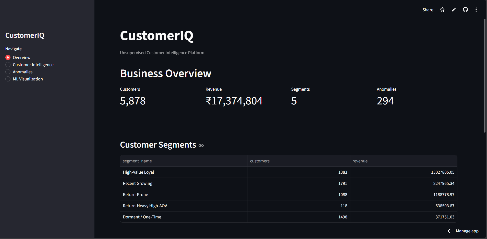
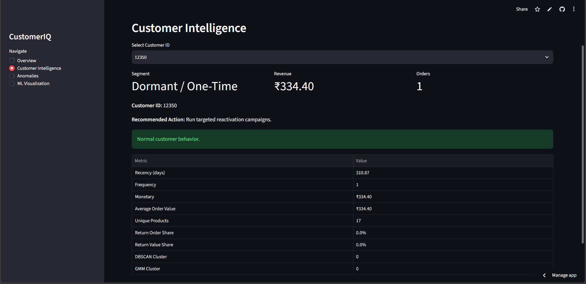
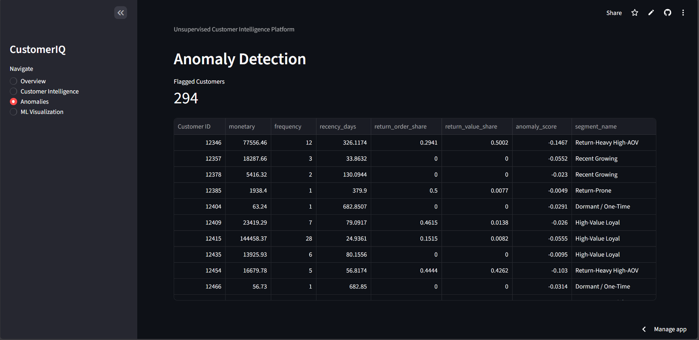
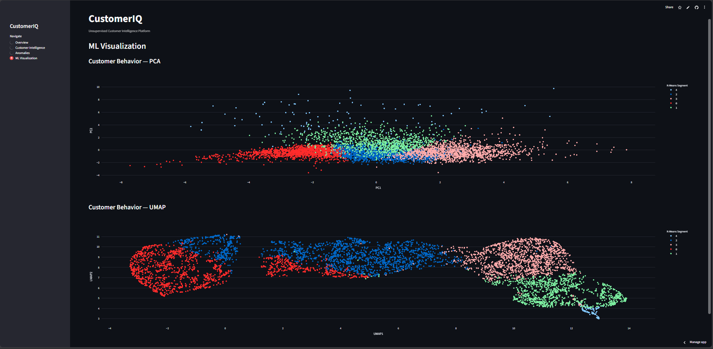

# CustomerIQ — Unsupervised Customer Intelligence Platform

[](STREAMLIT_APP_URL)
[](https://hub.docker.com/r/armanshikalgar/customeriq-api)
[](https://hub.docker.com/r/armanshikalgar/customeriq-dashboard)
[](https://www.python.org/)
[](https://fastapi.tiangolo.com/)
[](https://streamlit.io/)
[](https://www.docker.com/)

> An end-to-end customer analytics platform that uses unsupervised machine learning to segment customers, detect anomalous behavior, visualize customer patterns, and generate actionable customer intelligence.

---

## 🚀 Live Demo

### Streamlit Dashboard

**[Open CustomerIQ →](https://customeriq-by-arman.streamlit.app/)**

> Replace `STREAMLIT_APP_URL` with the final Streamlit Community Cloud URL.

### FastAPI Backend

**[Open FastAPI Swagger Docs →](https://customeriq-api-gxbc.onrender.com/docs)**

The deployed dashboard provides:

- Business overview
- Customer segmentation
- Individual customer intelligence
- Anomaly detection
- PCA visualization
- UMAP visualization
- Recommended customer actions

---

## 📸 Dashboard Preview

### Business Overview



### Customer Intelligence



### Anomaly Detection



### ML Visualization



---

## 🎯 Project Objective

Traditional customer analysis often focuses on basic metrics such as revenue and order count.

CustomerIQ goes further by combining:

- RFM-style customer behavior features
- Return behavior
- Customer segmentation
- Density-based clustering
- Probabilistic clustering
- Anomaly detection
- Dimensionality reduction
- Business recommendations

The goal is to transform raw transactional data into **actionable customer intelligence**.

---

# 🧠 Machine Learning Pipeline

```text
Raw Transaction Data
        │
        ▼
Data Understanding & Cleaning
        │
        ▼
SQL-based EDA
        │
        ▼
Feature Engineering
        │
        ▼
Customer Behavior Features
        │
        ├───────────────┐
        ▼               ▼
    K-Means          DBSCAN
        │               │
        │               ▼
        │              GMM
        │               │
        └───────┬───────┘
                ▼
       Customer Segments
                │
                ▼
       Anomaly Detection
                │
                ▼
          PCA + UMAP
                │
                ▼
       Customer Intelligence
                │
        ┌───────┴────────┐
        ▼                ▼
     FastAPI          Streamlit
        │                │
        └───────┬────────┘
                ▼
             Docker
````

---

# 🤖 Machine Learning Techniques

## K-Means Clustering

Used as the primary customer segmentation algorithm.

It groups customers according to behavioral similarity using engineered customer-level features.

### Purpose

* Identify customer groups
* Understand customer behavior
* Support targeted business strategies

---

## DBSCAN

Density-based clustering used to identify naturally occurring customer groups and potential noise points.

Useful because it does not require every customer to belong to a predefined cluster.

---

## Gaussian Mixture Model

GMM provides a probabilistic clustering perspective.

Instead of treating customers as belonging to rigid boundaries, it models customers as belonging to underlying probability distributions.

---

## PCA

Principal Component Analysis reduces the dimensionality of customer behavior features while retaining the major sources of variance.

CustomerIQ uses PCA to visualize high-dimensional customer behavior in two dimensions.

---

## UMAP

UMAP provides a nonlinear dimensionality reduction technique for exploring customer behavior and cluster structure.

It is particularly useful for identifying local patterns that may not be obvious in PCA.

---

## Anomaly Detection

CustomerIQ identifies customers whose behavior differs significantly from the normal customer population.

Potential examples include:

* Unusually high-value customers
* Unusual purchasing frequency
* Unusual recency
* Abnormal return behavior

---

# 📊 Customer Intelligence

For an individual customer, the dashboard provides:

| Metric              | Description                           |
| ------------------- | ------------------------------------- |
| Recency             | Days since customer's last purchase   |
| Frequency           | Number of orders                      |
| Monetary            | Customer revenue                      |
| Average Order Value | Average value per order               |
| Unique Products     | Number of distinct products purchased |
| Return Order Share  | Proportion of orders returned         |
| Return Value Share  | Proportion of returned order value    |
| K-Means Segment     | Primary customer segment              |
| DBSCAN Cluster      | Density-based cluster                 |
| GMM Cluster         | Probabilistic cluster                 |
| Anomaly Status      | Whether unusual behavior was detected |
| Recommended Action  | Suggested business action             |

---

# 🔍 Business Use Cases

CustomerIQ can support:

### Customer Retention

Identify valuable customers whose recent activity has declined.

### Customer Segmentation

Create behavioral groups for targeted marketing campaigns.

### High-Value Customer Identification

Identify customers generating significant revenue.

### Anomaly Detection

Find unusual purchasing or return behavior.

### Marketing Personalization

Use behavioral segments to design targeted customer strategies.

### Customer Risk Analysis

Identify customers whose behavior may require intervention.

---

# 🖥️ Application Architecture

```text
                   CustomerIQ
                       │
              ┌────────┴────────┐
              │                 │
           Streamlit          FastAPI
          Dashboard           Backend
              │                 │
              │         REST API Endpoints
              │                 │
              └────────┬────────┘
                       │
                 Processed Data
                       │
                Parquet Datasets
                       │
              Machine Learning
              Pipeline Results
```

---

# ⚡ FastAPI

CustomerIQ includes a FastAPI backend that exposes customer intelligence through REST endpoints.

### Example

```http
GET /customers/{customer_id}
```

Returns customer-level intelligence including:

* Segment
* Revenue
* Frequency
* Recency
* Return behavior
* Clustering results
* Anomaly status
* Recommended action

### Anomaly Endpoint

```http
GET /anomalies
```

Returns customers flagged by the anomaly detection pipeline.

---

# 🎨 Streamlit Dashboard

The Streamlit application provides four main sections:

### 1. Overview

Business-level KPIs and customer segment distribution.

### 2. Customer Intelligence

Select a customer and inspect their behavioral profile.

### 3. Anomalies

Explore customers flagged as anomalous.

### 4. ML Visualization

Interactive PCA and UMAP visualizations of customer behavior.

---

# ☁️ Deployed Architecture

CustomerIQ is deployed as separate frontend and backend services:

```text
Streamlit Community Cloud
        │
        │ HTTPS / REST API
        ▼
Render
FastAPI Backend
        │
        ▼
Processed Customer Intelligence Data
```

- **Frontend:** Streamlit Community Cloud
- **Backend:** FastAPI on Render
- **Container Registry:** Docker Hub
- **Local orchestration:** Docker Compose

**FastAPI service:** https://customeriq-api-gxbc.onrender.com  
**Swagger documentation:** https://customeriq-api-gxbc.onrender.com/docs

---

# 🐳 Docker

The project is containerized using Docker Compose.

Two services are used:

```text
customeriq-api
      │
      │ :8000
      ▼
   FastAPI


customeriq-dashboard
      │
      │ :8501
      ▼
   Streamlit
```

### Run locally

```bash
docker compose up
```

Dashboard:

```text
http://localhost:8501
```

API:

```text
http://localhost:8000
```

API documentation:

```text
http://localhost:8000/docs
```

---

# 📦 Docker Images

The project provides separate Docker images for the backend and dashboard.

### CustomerIQ API

**[Docker Hub → armanshikalgar/customeriq-api](https://hub.docker.com/r/armanshikalgar/customeriq-api)**

```bash
docker pull armanshikalgar/customeriq-api:latest
```

### CustomerIQ Dashboard

**[Docker Hub → armanshikalgar/customeriq-dashboard](https://hub.docker.com/r/armanshikalgar/customeriq-dashboard)**

```bash
docker pull armanshikalgar/customeriq-dashboard:latest
```

Docker Hub repositories allow the published images to be distributed and pulled independently. ([Docker Documentation][3])

---

# 🛠️ Tech Stack

### Programming

* Python

### Data Analytics

* Pandas
* NumPy
* SQL
* PyArrow

### Visualization

* Matplotlib
* Seaborn
* Plotly
* Streamlit

### Machine Learning

* Scikit-learn
* K-Means
* DBSCAN
* Gaussian Mixture Model
* PCA
* UMAP
* Anomaly Detection

### Backend

* FastAPI
* Uvicorn
* Requests

### Deployment & DevOps

* Docker
* Docker Compose
* Docker Hub
* Streamlit Community Cloud

### Development

* Jupyter Notebook
* Git
* GitHub

---

# 📁 Project Structure

```text
CustomerIQ/
│
├── api/
│   ├── __init__.py
│   └── main.py
│
├── app/
│   └── streamlit_app.py
│
├── data/
│   └── processed/
│       ├── customer_anomalies.parquet
│       ├── customer_features.parquet
│       ├── customer_features_ml.parquet
│       ├── customer_intelligence.parquet
│       ├── customer_projections.parquet
│       ├── customer_returns.parquet
│       ├── customer_sales.parquet
│       ├── customer_segments_dbscan.parquet
│       ├── customer_segments_gmm.parquet
│       └── customer_segments_kmeans.parquet
│
├── notebooks/
│   ├── 01_data_understanding.ipynb
│   ├── 02_sql_eda.ipynb
│   ├── 03_feature_engineering.ipynb
│   ├── 04_kmeans.ipynb
│   ├── 05_dbscan_gmm.ipynb
│   ├── 06_pca_umap.ipynb
│   ├── 07_anomaly_detection.ipynb
│   └── 08_market_basket.ipynb
│
├── src/
│   └── intelligence/
│       ├── build_customer_intelligence.py
│       └── build_customer_projections.py
│
├── Dockerfile
├── docker-compose.yml
├── requirements.txt
├── .gitignore
└── README.md
```

---

# 🚀 Local Setup

### Clone the repository

```bash
git clone https://github.com/armanshikalgar/CustomerIQ.git
cd CustomerIQ
```

### Create environment

```bash
python -m venv myenv
```

Windows:

```bash
myenv\Scripts\activate
```

### Install dependencies

```bash
pip install -r requirements.txt
```

### Run Streamlit

```bash
streamlit run app/streamlit_app.py
```

### Run FastAPI

```bash
uvicorn api.main:app --reload
```

---

# 🐳 Run with Docker

```bash
docker compose up --build
```

Then open:

```text
http://localhost:8501
```

---

# 📈 Project Highlights

* End-to-end customer analytics pipeline
* Customer-level behavioral feature engineering
* Multiple unsupervised ML algorithms
* Customer segmentation
* Anomaly detection
* PCA and UMAP visualization
* REST API using FastAPI
* Interactive Streamlit dashboard
* Dockerized multi-service architecture
* Docker Hub images
* Cloud deployment of the Streamlit dashboard and FastAPI backend

---

# 🔮 Future Improvements

* Automated model retraining pipeline
* Customer lifetime value prediction
* Churn prediction
* Real-time transaction ingestion
* Automated customer alerts
* Authentication for API endpoints
* CI/CD pipeline
* Cloud deployment of the Streamlit dashboard and FastAPI backend of the complete Dockerized architecture

---

## 🌐 Deployment Separation 

The Streamlit dashboard is deployed on Streamlit Community Cloud, while the FastAPI backend is deployed separately on Render.

```text
Streamlit Cloud
      │
      │ HTTPS / REST API
      ▼
Render — FastAPI
```

---

# 👨‍💻 Author

**Arman Shikalgar**

Final Year B.Tech — Artificial Intelligence & Data Science

GitHub: [@armanshikalgar](https://github.com/Arman1263)

---

## ⭐ Project

If you find this project useful, consider giving the repository a star.

````

---

## 🔗 Deployment Links

- **Streamlit Dashboard:** `STREAMLIT_APP_URL`
- **FastAPI Service:** https://customeriq-api-gxbc.onrender.com
- **FastAPI Docs:** https://customeriq-api-gxbc.onrender.com/docs
- **Docker Hub — API:** https://hub.docker.com/r/armanshikalgar/customeriq-api
- **Docker Hub — Dashboard:** https://hub.docker.com/r/armanshikalgar/customeriq-dashboard
- **GitHub:** https://github.com/armanshikalgar/CustomerIQ
